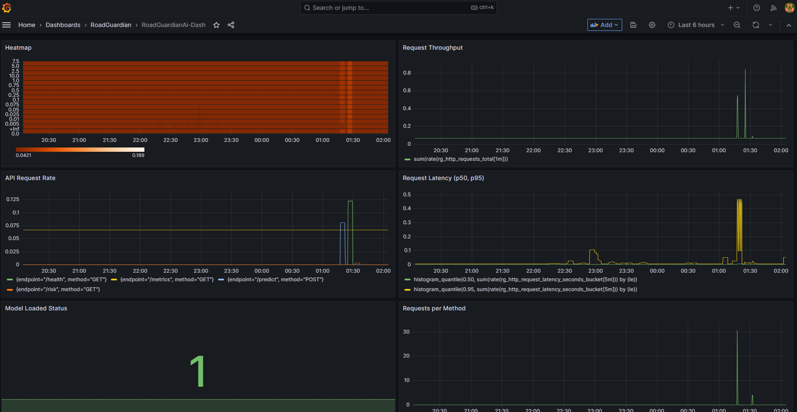
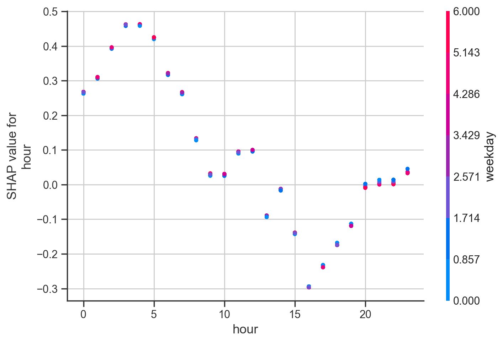
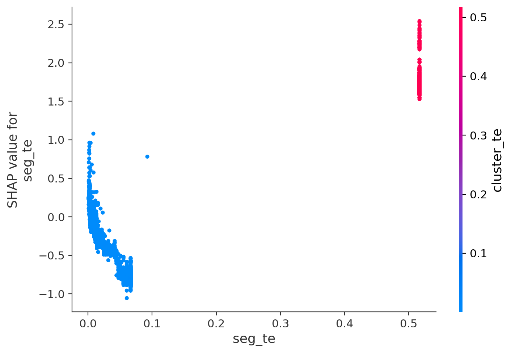
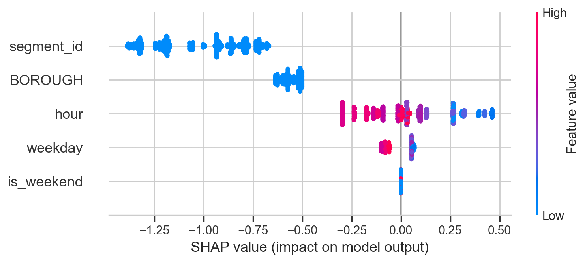
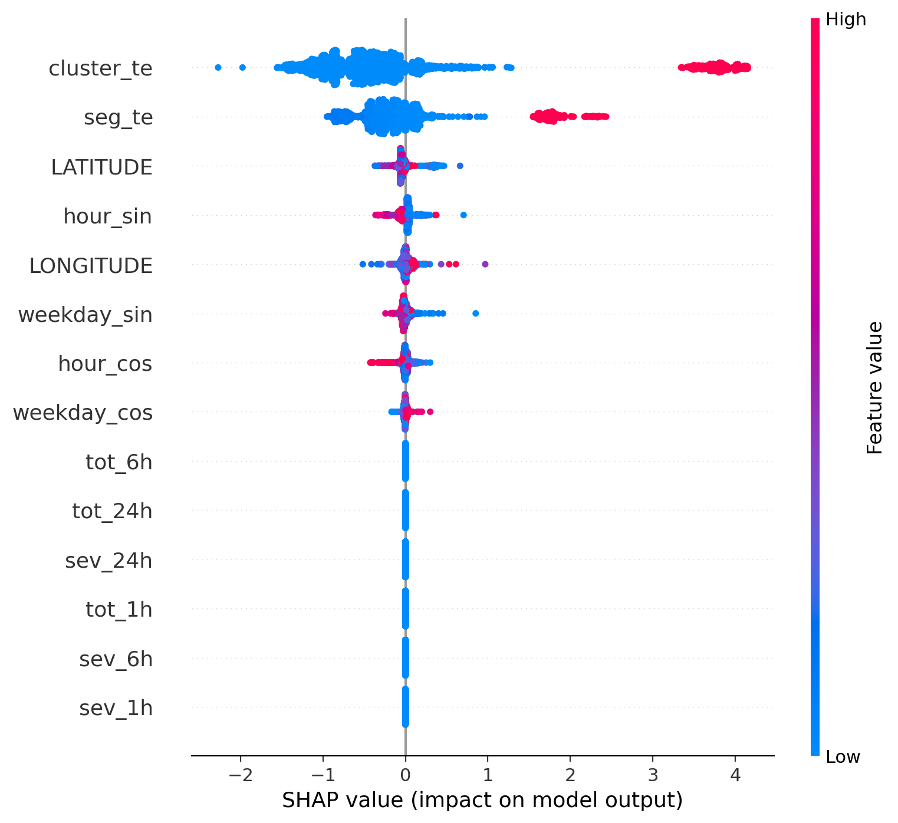
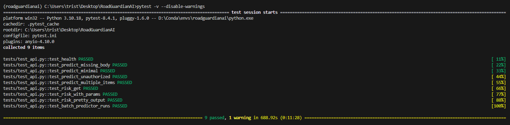

# RoadGuardianAI
Risk prediction API for road segments LightGBM baseline, batch predictions, Postgres persistence, Prometheus metrics and Grafana dashboards.

LightGBM baseline model trained on the accident dataset  
FastAPI server exposing /predict, /risk, /health and /metrics  
Batch prediction runner that saves outputs to Parquet and Postgres  
Prometheus instrumentation and Grafana dashboards for monitoring  
Unit tests (pytest) for the API and batch pipeline  
SHAP analyses (dependence plots and beeswarm) used for interpretability  

# Local Development

Step 1:
Clone this repo
```
git clone https://github.com/TristanRG/RoadGuardianAI.git
```

Step 2:
Create your own .env in the repository root
```
code .env
```

Step 3:
Compose the docker system and start all the services
```
docker-compose up -d --build
```

# API Endpoints

GET /health  
Returns model + data availability status  
POST /predict  
Predict risk for one or more segments  
GET & POST /risk  
Returns top-K risky segments for a time window  
GET /metrics  
Prometheus scraped endpoint with metrics  

# Prometheus & Grafana

App exposes /metrics endpoint. Prometheus scrapes that endpoint and Grafana uses Prometheus as a datasource.



# SHAP

Anylyses that show feature impact and conditional relationships based on the model training
 

  

  



# Unit Testing

Created unit tests to test the API endpoints and the batch pipeline



# Dataset 

Used the official NYC Motor Vehicle Collisions dataset for training and analysis:

[Dataset: Motor Vehicle Collisions - Crashes (NYC Open Data)](https://data.cityofnewyork.us/Public-Safety/Motor-Vehicle-Collisions-Crashes/h9gi-nx95)

